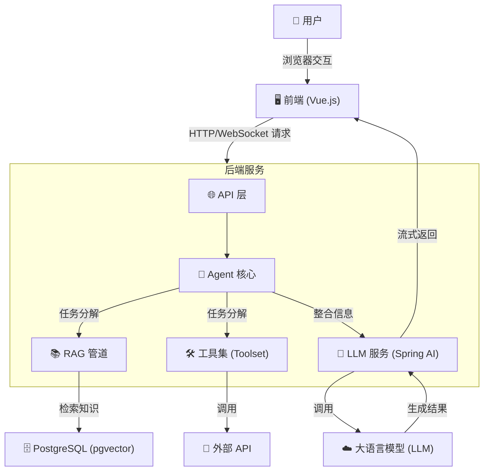
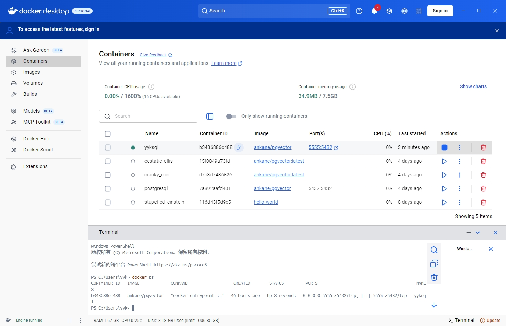
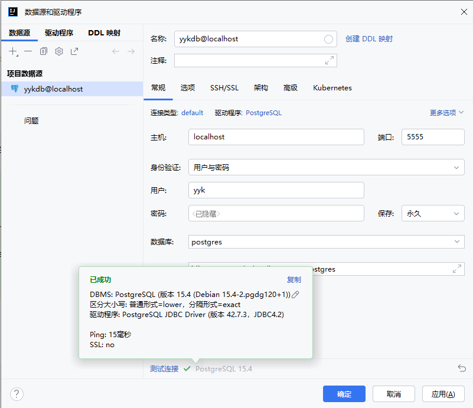
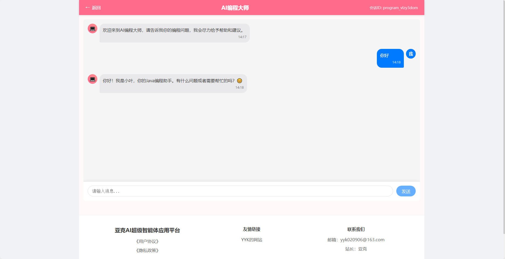
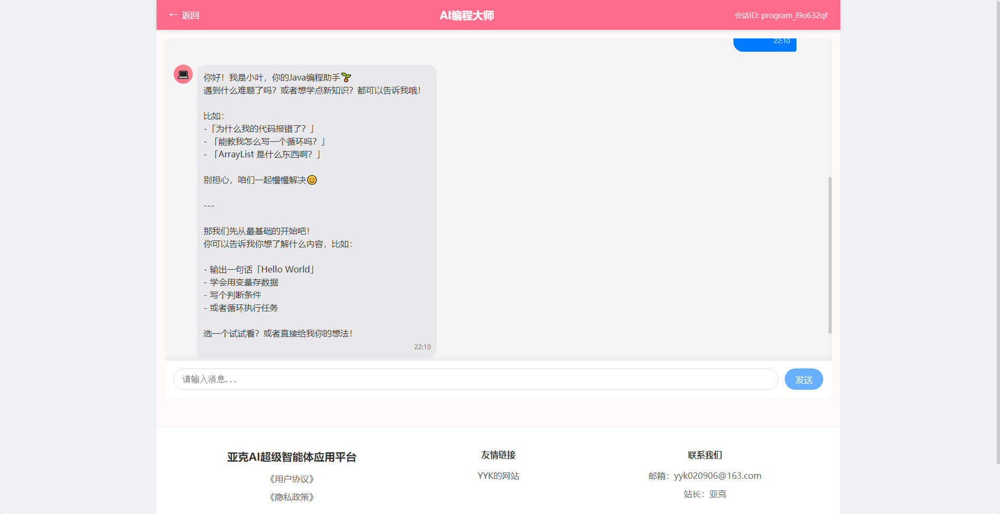
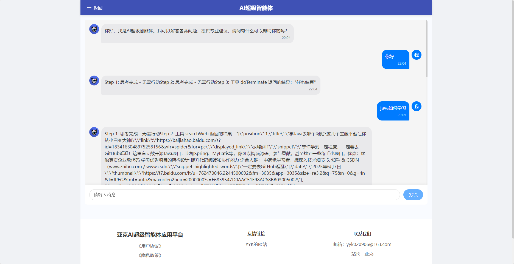
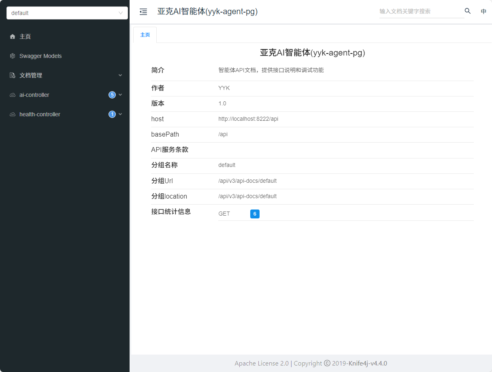
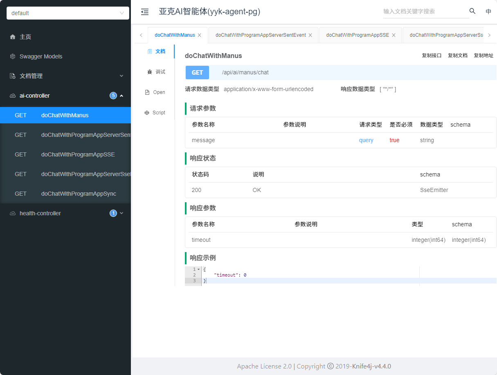

# 亚克AI智能体(yyk-agent-pg)

`亚克AI智能体` 是一个功能强大的、基于大语言模型（LLM）的智能代理（Agent）项目。它结合了先进的检索增强生成（RAG）技术，并提供了一套可扩展的工具系统，旨在成为一个高度智能的编程助手和自动化任务处理平台。

项目采用前后端分离架构，后端基于 Java 和 Spring Boot，前端采用 Vue.js 构建，为用户提供了一个直观易用的交互界面。

---

## 🏗️ 系统架构图


**架构说明：**
项目遵循经典的前后端分离模式。用户通过 **Vue.js 前端** 发送请求，**Spring Boot 后端** 接收请求后，由 **Agent 核心**进行意图理解和任务编排。如果需要，它会调用 **RAG 管道**从 **PostgreSQL (pgvector)** 向量数据库中检索知识，或通过 **Toolset** 调用外部API，最终将整合后的信息交由 **LLM** 处理，并将结果流式返回给前端。

---

## ✨ 核心功能模块

本项目主要由以下几个核心模块构成：

1.  **智能代理 (Agent Core)**
    *   **职责**: 作为系统的大脑，负责处理用户输入、管理多轮对话状态、并编排任务。
    *   **实现**: 实现了 ReAct (Reason + Action) 和 Tool Calling 等多种代理模式，使其能够进行逻辑推理和决策。

2.  **检索增强生成 (RAG)**
    *   **职责**: 连接外部知识库，为 LLM 提供准确、实时的信息，以减少幻觉并增强回答的相关性。
    *   **实现**: 包含了文档加载、文本分割、向量化和存储的全套流程。利用 `pgvector` 进行高效的相似性搜索。

3.  **可扩展工具集 (Toolset)**
    *   **职责**: 为 Agent 提供与外部世界交互的能力。
    *   **实现**: 内置了文件操作、终端命令执行、Web搜索等工具。框架支持函数式接口，可以轻松地注册新的自定义工具。

4.  **模型服务 (Model Service)**
    *   **职责**: 抽象化与底层大语言模型的通信。
    *   **实现**: 基于 `Spring AI`，屏蔽了不同 LLM 提供商（如 Dashscope, Ollama）的接口差异，使模型切换和扩展变得简单。

5.  **Web 接口层 (API Layer)**
    *   **职责**: 为前端提供稳定、高效的 RESTful API。
    *   **实现**: 使用 Spring Web 构建，并通过 `Knife4j` 自动生成交互式 API 文档。

---

## 🎯 技术选型说明

| 分类     | 技术                      | 选型理由                                                                                                                              |
| :------- | :------------------------ | :------------------------------------------------------------------------------------------------------------------------------------ |
| **后端** | `Spring Boot 3` & `Java 21` | 业界领先的Java开发框架，生态成熟、社区活跃。Java 21 作为最新的LTS版本，在性能和新特性上都有显著优势。                                |
|          | `Spring AI`               | 官方维护的AI工程框架，无缝整合 Spring 生态，提供了强大的模型、Embeddings、向量数据库抽象，让AI应用开发更简单、更便携。                |
| **前端** | `Vue 3` & `Vite`          | 提供了极致的开发体验和卓越的性能。Vue 3 的 Composition API 非常适合构建像聊天机器人这样具有复杂交互状态的应用。                          |
| **数据库** | `PostgreSQL` + `pgvector` | PostgreSQL 是功能最强大的开源关系型数据库之一。`pgvector` 扩展使其能够在一个数据库中同时处理结构化数据和向量数据，极大地简化了技术栈和维护成本。 |

---

## 🚀 快速开始

### 1. 环境准备

在开始之前，请确保您的开发环境中安装了以下软件：

*   JDK 21 或更高版本
*   Maven 3.9 或更高版本
*   Node.js 18 或更高版本
*   Docker 和 Docker Compose

### 2. 本地服务准备 (Docker)

为了方便开发，我们强烈建议使用 Docker 启动项目所需的 PostgreSQL 数据库。

1.  **拉取镜像**
    ```bash
    # 推荐使用国内镜像，速度更快
    docker pull docker.1panel.live/ankane/pgvector

    # 如果拉取失败，请尝试官方镜像
    # docker pull ankane/pgvector
    ```

2.  **启动容器**
    此命令将启动一个名为 `yyksql` 的 PostgreSQL 容器，并自动创建一个名为 `yykdb` 的数据库。
    ```bash
    docker run --name yyksql -e POSTGRES_USER=yyk -e POSTGRES_PASSWORD=yyk123 -e POSTGRES_DB=yykdb -p 5432:5432 -d docker.1panel.live/ankane/pgvector
    
    # 如果启动失败，请尝试官方镜像
    # docker run --name yyksql -e POSTGRES_USER=yyk -e POSTGRES_PASSWORD=yyk123 -e POSTGRES_DB=yykdb -p 5432:5432 -d ankane/pgvector
    ```

3.  **校验**
    执行 `docker ps`，您应该能看到 `yyk-pgvector` 容器正在运行。
    
    如图：



### 3. 初始化数据库

1.  使用IDEA自带的工具连接到在 Docker 中运行的 PostgreSQL 实例。
    *   **Host**: `localhost`
    *   **Port**: `5432`
    *   **User**: `yyk`
    *   **Password**: `yyk123`
    *   **Database**: `yykdb`
    如图：


2.  连接成功后，执行以下 SQL 脚本以启用向量扩展并创建所需的表：
    ```sql
    -- 1. 开启 pgvector 扩展
    CREATE EXTENSION IF NOT EXISTS vector;  

    -- 2. 创建存储向量的表  
    CREATE TABLE IF NOT EXISTS public.vector_store  
    (  
        id        UUID PRIMARY KEY DEFAULT gen_random_uuid(),  
        content   TEXT,  
        metadata  JSONB,  
        embedding VECTOR(1536)  
    ); 
    ```

### 4. 后端启动 (`yyk-agent`)

1. **配置**
    *   进入 `yyk-agent` 目录。
    *   复制 `src/main/resources/application-local.yml.example` 为 `application-local.yml`。
    *   **请确保 `application-local.yml` 中的数据库配置与 Docker 启动参数一致**，并填入您的 AI 模型 API Key。
    ```yaml
    spring:
      datasource:
        url: jdbc:postgresql://localhost:5432/yyk-ai-agent
        username: yyk
        password: yyk123
      ai:
        dashscope:
          api-key: "your-api-key-here"
    ```

2. **构建和运行**
    *   使用 Maven 构建项目：`mvn clean install`
    *   运行 Spring Boot 应用：`java -jar target/yyk-agent-0.0.1-SNAPSHOT.jar`
    *   后端服务将运行在 `http://localhost:8222`，
    * API 文档位于 `http://localhost:8222/api/doc.html#/home

### 5. 前端启动 (`yyk-agent-frontend`)

1. **安装依赖**: `cd yyk-agent-frontend && npm install`
2. **运行开发服务器**: `npm run dev`
3. **访问应用**: 前端将运行在 `http://localhost:8221` (或终端提示的其他端口)。

---

## 📝 配置敏感信息

本项目使用了多个需要API密钥的服务。为了保护这些敏感信息，我们采用了以下策略：

1. **本地开发环境**：
    - 所有敏感信息存储在 `application-local.yml` 文件中
    - 该文件已添加到 `.gitignore`，不会被提交到Git仓库
    - 开发者需要根据 `application-local.yml.example` 模板创建自己的本地配置

2. **生产环境**：
    - 生产环境使用环境变量注入敏感信息
    - 参考 `application-prod.yml` 中的环境变量名称
    - 可以使用Docker环境变量、Kubernetes Secrets或其他安全的配置管理工具

3. **需要配置的敏感信息**：
    - PostgreSQL数据库连接信息
    - 通义千问 DashScope API密钥
    - 搜索API密钥

---

## 📖 项目结构

```
.
├── yyk-agent/              # 后端 Spring Boot 项目
│   ├── pom.xml
│   └── src/
│       ├── main/
│       │   ├── java/com/yyk/
│       │   │   ├── agent/      # 智能代理核心逻辑
│       │   │   ├── app/        # 应用相关，如文档加载
│       │   │   ├── rag/        # RAG 相关配置和实现
│       │   │   └── tools/      # 可供 Agent 调用的工具
│       │   └── resources/
│       │       ├── application.yml            # 主配置文件
│       │       ├── application-local.yml      # 本地敏感配置（不提交到Git）
│       │       ├── application-local.yml.example # 本地配置模板
│       │       ├── application-prod.yml       # 生产环境配置模板
│       │       └── document/     # RAG 的本地知识库文档
│       └── test/
└── yyk-agent-frontend/     # 前端 Vue.js 项目
    ├── package.json
    ├── vite.config.js
    └── src/
        ├── api/            # API 请求
        ├── components/     # Vue 组件
        ├── views/          # 页面视图
        └── App.vue         # 主应用组件
```

---

## 💡 未来展望 (Roadmap)

*   [ ] **Agent 记忆增强**: 引入更长期的记忆机制，使 Agent 能够跨会话记住关键信息。
*   [ ] **多模态支持**: 增加处理和生成图片的能力。
*   [ ] **主动式 Agent**: 使 Agent 能够根据预设目标主动执行任务，而不仅仅是被动回复。
*   [ ] **优化 RAG 管道**: 引入重排（Re-ranking）等高级技术，提升知识检索的准确性。
*   [ ] **用户认证与多租户**: 增加用户系统，支持多用户隔离使用。

---

## ✅ 测试情况

**前端聊天界面**




**后端API文档 (Knife4j)**
<!-- 在下方插入图片 -->



---

## 🤝 贡献

欢迎任何形式的贡献！如果您有好的想法或建议，请随时提交 Pull Request 或创建 Issue。

1.  Fork 本仓库
2.  创建您的特性分支 (`git checkout -b feature/AmazingFeature`)
3.  提交您的更改 (`git commit -m 'Add some AmazingFeature'`)
4.  推送到分支 (`git push origin feature/AmazingFeature`)
5.  打开一个 Pull Request

---

## 📄 许可证

本项目采用 [MIT License](LICENSE.txt) 许可证。