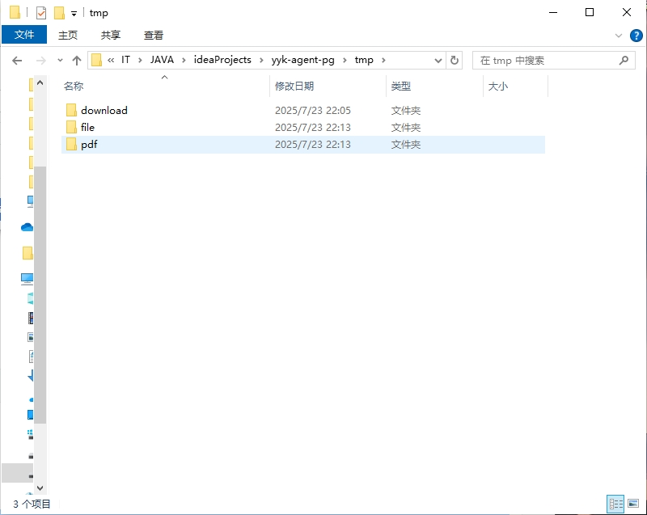
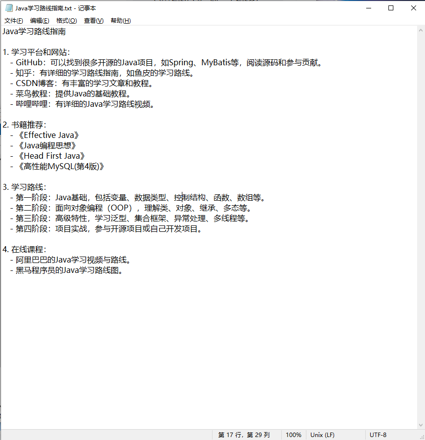

# yyk-agent-pg

`yyk-agent-pg` 是一个功能强大的、基于大语言模型（LLM）的智能代理（Agent）项目。它结合了先进的检索增强生成（RAG）技术，并提供了一套可扩展的工具系统，旨在成为一个高度智能的编程助手和自动化任务处理平台。

项目采用前后端分离架构，后端基于 Java 和 Spring Boot，前端采用 Vue.js 构建，为用户提供了一个直观易用的交互界面。

---

## ✨ 功能特性

*   **智能代理框架**: 实现了多种 Agent 工作模式，如 ReAct (Reason + Action) 和 Tool Calling，使 AI 能够自主思考、调用工具并完成复杂任务。
*   **检索增强生成 (RAG)**: 集成了 RAG 管道，利用 `PostgreSQL` 和 `pgvector` 扩展作为向量数据库，通过从本地知识库中检索相关信息来增强模型的回答，有效减少模型幻觉。
*   **可扩展的工具集**: 内置了多种实用工具，如**文件操作**、**终端命令执行**、**Web 搜索**、**PDF 生成**等，并且可以轻松扩展自定义工具。
*   **多模型支持**: 通过 Spring AI 抽象，可以方便地接入和切换多种大语言模型，如 `Ollama` (用于本地部署)、`通义千问 Dashscope` 等。
*   **现代化前后端分离**:
    *   **后端**: 基于 `Spring Boot 3` 和 `JDK 21`，提供稳定、高性能的 RESTful API。
    *   **前端**: 基于 `Vue.js 3` 和 `Vite`，提供了一个美观、响应迅速的聊天式交互界面。
*   **容器化支持**: 提供了 `Dockerfile`，支持使用 Docker 进行快速部署。

---

## 🛠️ 技术栈

|              | 技术                                                       |
| :----------- | :--------------------------------------------------------- |
| **后端**     | `Java 21`, `Spring Boot 3`, `Spring AI`, `Maven`, `Lombok` |
| **前端**     | `Vue.js 3`, `Vite`, `JavaScript`, `Axios`                  |
| **数据库**   | `PostgreSQL` + `pgvector` 扩展                             |
| **API 文档** | `SpringDoc` + `Knife4j`                                    |
| **容器化**   | `Docker`                                                   |

---

## 🚀 快速开始

### 1. 环境准备

在开始之前，请确保您的开发环境中安装了以下软件：

*   **JDK 21** 或更高版本
*   **Maven 3.9** 或更高版本
*   **Node.js 18** 或更高版本
*   **Docker** 和 **Docker Compose**
*   **PostgreSQL 15** 或更高版本，并已**启用 `pgvector` 扩展**。

### 2. 后端启动 (`yyk-agent`)

1. **配置**

    *   进入 `yyk-agent` 目录。
    *   复制 `src/main/resources/application-local.yml.example` 为 `application-local.yml`
    *   在 `application-local.yml` 中填入您的数据库连接信息和 AI 模型 API Key。

   ```yaml
   spring:
     datasource:
       url: jdbc:postgresql://localhost:5432/your_db
       username: your_username
       password: your_password
     ai:
       dashscope:
         api-key: "your-api-key-here"
   ```

2. **构建和运行**

    * 使用 Maven 构建项目：

      ```bash
      cd yyk-agent
      mvn clean install
      ```

    * 运行 Spring Boot 应用：

      ```bash
      java -jar target/yyk-agent-0.0.1-SNAPSHOT.jar
      ```

    * 启动成功后，后端服务将运行在 `http://localhost:8222/api`。

    * 您可以访问 `http://localhost:8222/api/doc.html` 查看 API 文档。

### 3. 前端启动 (`yyk-agent-frontend`)

1. **安装依赖**

   ```bash
   cd yyk-agent-frontend
   npm install
   ```

2. **运行开发服务器**

   ```bash
   npm run dev
   ```

3. **访问应用**

    *   前端开发服务器将运行在 `http://localhost:8221` (或终端提示的其他端口)。
    *   打开浏览器访问该地址即可开始与智能代理进行交互。

---

## 📝 配置敏感信息

本项目使用了多个需要API密钥的服务。为了保护这些敏感信息，我们采用了以下策略：

1. **本地开发环境**：
    - 所有敏感信息存储在 `application-local.yml` 文件中
    - 该文件已添加到 `.gitignore`，不会被提交到Git仓库
    - 开发者需要根据 `application-local.yml.example` 模板创建自己的本地配置

2. **生产环境**：
    - 生产环境使用环境变量注入敏感信息
    - 参考 `application-prod.yml` 中的环境变量名称
    - 可以使用Docker环境变量、Kubernetes Secrets或其他安全的配置管理工具

3. **需要配置的敏感信息**：
    - PostgreSQL数据库连接信息
    - 通义千问 DashScope API密钥
    - 搜索API密钥

---

## 📖 项目结构

```
.
├── yyk-agent/              # 后端 Spring Boot 项目
│   ├── pom.xml
│   └── src/
│       ├── main/
│       │   ├── java/com/yyk/
│       │   │   ├── agent/      # 智能代理核心逻辑
│       │   │   ├── app/        # 应用相关，如文档加载
│       │   │   ├── rag/        # RAG 相关配置和实现
│       │   │   └── tools/      # 可供 Agent 调用的工具
│       │   └── resources/
│       │       ├── application.yml            # 主配置文件
│       │       ├── application-local.yml      # 本地敏感配置（不提交到Git）
│       │       ├── application-local.yml.example # 本地配置模板
│       │       ├── application-prod.yml       # 生产环境配置模板
│       │       └── document/     # RAG 的本地知识库文档
│       └── test/
└── yyk-agent-frontend/     # 前端 Vue.js 项目
    ├── package.json
    ├── vite.config.js
    └── src/
        ├── api/            # API 请求
        ├── components/     # Vue 组件
        ├── views/          # 页面视图
        └── App.vue         # 主应用组件
```

---

## 🤝 贡献

欢迎任何形式的贡献！如果您有好的想法或建议，请随时提交 Pull Request 或创建 Issue。

1.  Fork 本仓库
2.  创建您的特性分支 (`git checkout -b feature/AmazingFeature`)
3.  提交您的更改 (`git commit -m 'Add some AmazingFeature'`)
4.  推送到分支 (`git push origin feature/AmazingFeature`)
5.  打开一个 Pull Request

---

## 测试情况





---

## 📄 许可证

本项目采用 [MIT License](./LICENSE) 许可证。 